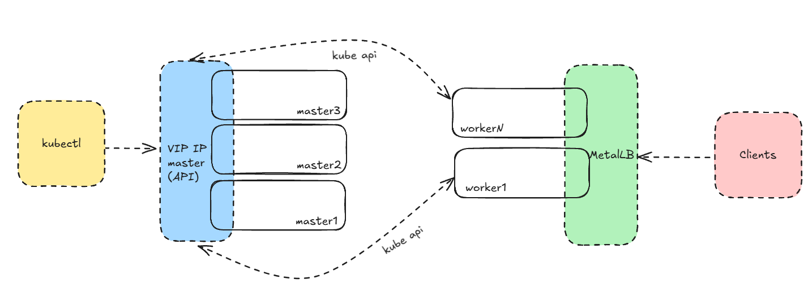

# Роль для создания HA кластера k8s

## Описание 
Схема раскатки:

Без использования haproxy!
Для мастеров используется VIP IP (keepalived) как control-plane-endpoint.

## Совместимость
Тестировалось на https://cloud.debian.org/images/cloud/bookworm/latest/debian-12-generic-amd64.qcow2 

## Если не доступна загрузка пакетов с гугл
Ставим зеркало от яндекса:

`kubernetes_apt_repository: 'https://mirror.yandex.ru/mirrors/pkgs.k8s.io/core/stable/v{{ kubernetes_version }}/deb'`

## Примечания
### Loadbalancer 
Для работы ingress можно поставить 
```
helm repo add metallb https://metallb.github.io/metallb
helm repo update
helm upgrade -i -n metallb-system --create-namespace metallb metallb/metallb
```
И применяем CRD с пулом:

```
apiVersion: metallb.io/v1beta1
kind: IPAddressPool
metadata:
  name: default-pool
  namespace: metallb-system
spec:
   addresses:
   - 192.168.1.200/32  # IP с пула VM кластера
---
apiVersion: metallb.io/v1beta1
kind: L2Advertisement
metadata:
  name: default-pool-advertisement
  namespace: metallb-system
spec:
  ipAddressPools:
  - default-pool
```